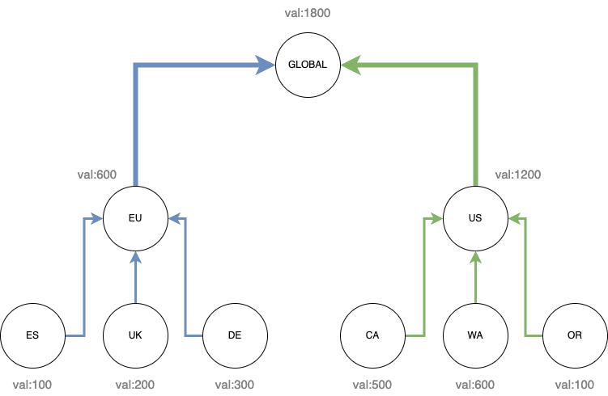

# JetStream Distributed Counter CRDT

| Metadata | Value      |
|----------|------------|
| Date     | 2025-01-09 |
| Author   | @ripienaar |
| Status   | Approved   |
| Tags     | jetstream  |

| Revision | Date       | Author     | Info                    |
|----------|------------|------------|-------------------------|
| 1        | 2025-01-09 | @ripienaar | Document Initial Design |

## Context and Motivation

We wish to provide a distributed counter that will function in Clusters, Super Clusters, through Sources and any other way that data might reach a Stream.

We will start with basic addition and subtraction primitives which will automatically behave as a CRDT and be order independent.

Related:

 * [Netflix Distributed Counter](https://netflixtechblog.com/netflixs-distributed-counter-abstraction-8d0c45eb66b2)

## Solution Overview

A Stream can opt-in to supporting Counters which will allow any subject to be a counter.

Publishing a message to such a Stream will load the most recent message on the subject, increment its value and save 
the new message with the latest value in the body. The header is preserved for downstream processing by Sources and for 
visibility and debugging purposes.

```bash
$ nats s get COUNTER --last-for counter.hits
Item: COUNTER#22802062 received 2025-01-09 18:05:07.93747413 +0000 UTC on Subject counter.hits

Headers:
  Nats-Incr: +2

{"val":"100"}
$ nats pub counter.hits '' -J -H "Nats-Incr:+1"
$ nats s get COUNTER --last-for counter.hits
Item: COUNTER#22802063 received 2025-01-09 18:06:00 +0000 UTC on Subject counter.hits

Headers:
  Nats-Incr: +1

{"val":"101"}
```

## Design and Behavior

The goal is to support addition and subtraction only and that a Stream that Sources 10s of other Streams all with 
counters will effectively create a big combined counter holding totals contributed to by all sources.

Handling published messages has the follow behavior and constraints:

 * The header holds values like `+1`, `-1` and `-10`, in other words any valid `int64`, if the value fails to parse 
   the message is rejected with an error. A value of `0` is valid.
 * When publishing a message to the subject the last value is loaded, the body is parsed, incremented and written 
   into the new message body. The headers are all preserved.
 * If the addition will overflow a `int64` in either direction the message will be rejected with an error
 * When publishing a message and the previous message do not have a `Nats-Incr` header it means the subject is not a 
   counter, an error is returned to the user and the message is rejected
 * When a message has a `Nats-Rollup` header in addition to a `Nats-Incr` the previous message is loaded, calculation is done and all the history is deleted with the rollup message holding the current total 
 * When a message with the header is received over a Source, that has the configuration setting enabled, processing is 
   done as above otherwise the message is discarded
 * When a message with the header is published to a Stream without the option set the message is rejected with an error
 * When a message with the header is received over a Mirror the message is stored verbatim
 * When a message without the header is received and the previous message is a counter this will be rejected since 
   the subject is then treated as being a counter only. This could be very expensive on Streams with many 
   non-counter messages being written to them

The value in the body is stored in a struct with the following layout:

```go
type CounterValue struct {
	Value string `json:"val"`
}
```

We use a `string` value since JSON spec would only allow up to 2^53 for number, we might want to support BigInt kind of numbers.

## Recounts and Audit

It's important in many scenarios that counter values can be audited and recounts can happen. We preserve the `Nats-Incr` header separate from the body so given streams with limits applied one can manually recount the entire stream.

In the case of sourced streams the various headers that sourcing adds will provide further providence for a specific click.

## Counter Resets

It's important that counters can be reset to zero, in a simple standalone counter this is easily done with a subject purge. In a topology where multiple regions contribute to a total a regional reset might require a negative value to be published equal to the current total.

The preferred method for Reset should be a rollup, with subject purge being used only for entire counter deletes.

## Source-based Replicated Counters

> [!NOTE]
>
> This is half baked and largely here to solicit discussion

We want to be able to build large replicated global counters, but this present several challenges, the final goal can be seen in the diagram below:



When the counter is read at any location in the tree the value shown should be returned.

To achieve this topology we create sources that copy a subject between location and regions. The problem here would be that in order to get a fully global counter we end up with the same subject in all these Streams and locations and might end up with doube writes etc. 

We might say the regions listen on subjects like `count.es.hits` and we use rewriting during the sourcing to turn that into `count.eu.hits` and eventually `count.hits` with the aggregate streams not listening on any subject. 

In this scenario we lose the ability to access the `count.es.hits` value anywhere other than in the `es` location - not ideal. One could mirror from ES -> EU cluster and then Source in the EU cluster into an aggregate counter thus retaining the source and total.

Replicated counters further complicates matter wrt counter resets. In a standalone counter one can just purge the subject to reset it. In the replicated case a purge will not replicate, a roll-up would replicate and destroy the entire counter everywhere so the only real option is to publish a negative value (perhaps with a roll-up).

### Adding Sources

Adding a source that already has values in it and that had limits applied will be problematic since we will not have the history to fully recount the message in the target Stream.

Tooling might use a direct get to retrieve that value in the source, place that value into the target Stream and then starting the sourcing from seq+1, meaning we snapshot the Source value into the target and then only handle new counts.  This will scale well and avoid huge recounts, but, would require the target Stream to have a subject.

## Stream Configuration

Weather or not a Stream support this behavior should be a configuration opt-in. We want clients to definitely know
when this is supported which the opt-in approach with a boolean on the configuration would make clear.

```golang
type StreamConfig struct {
	// AllowMsgCounter enables the feature
	AllowMsgCounter bool          `json:"allow_msg_counter"`
}
```

Setting this on a Mirror should cause an error.

This feature can be turned off and on using Stream edits.

A Stream with this feature on should require API level 1.
